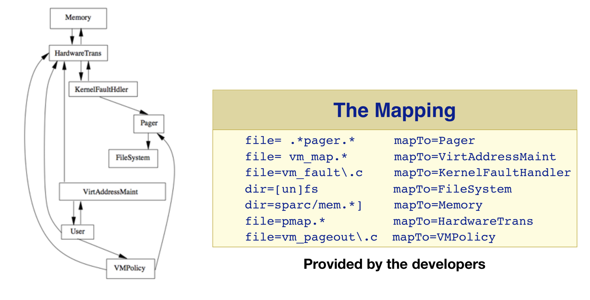
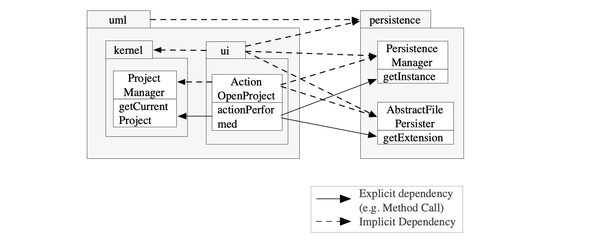
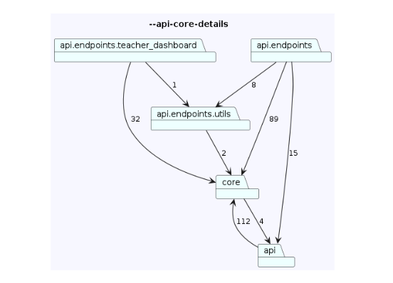
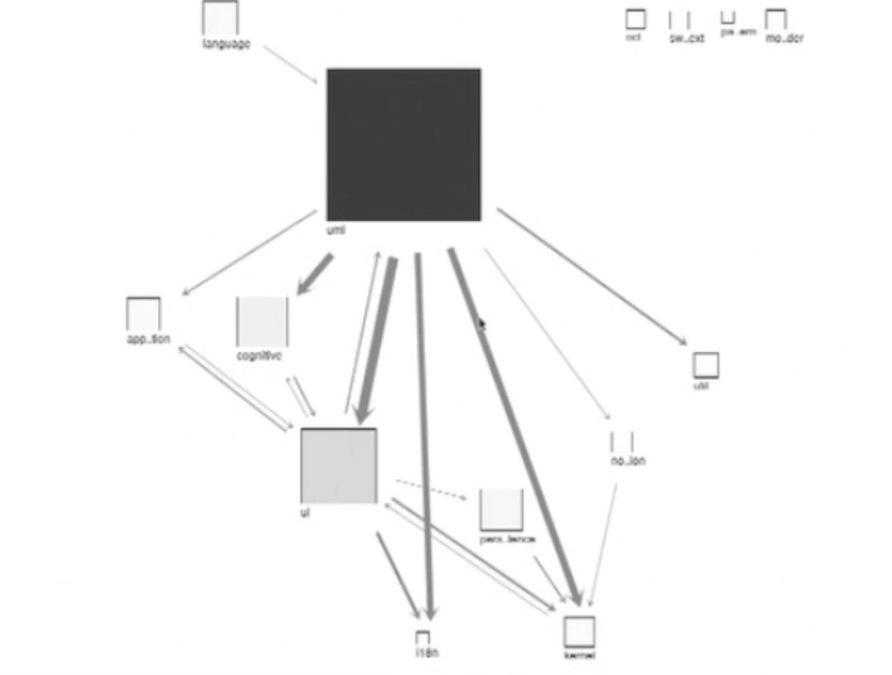
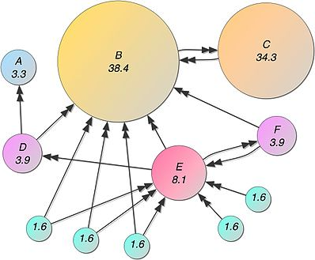
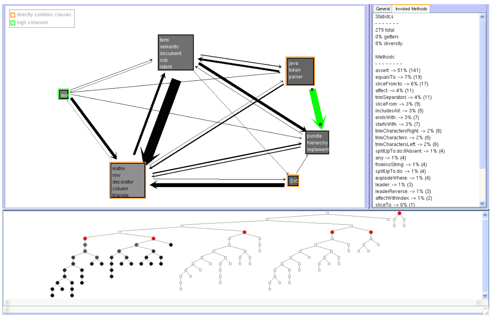

# The view obtained at the end of the last lecture...

... reflects reality,
... conveys the message that software is complex 
... could find a place in a modern art museum
... but is not architectural


- **System**: [zeeguu/api](https://github.com/zeeguu/api) 
- **Source View**: Modules & Dependencies
- **Entities**: .py files in the project
- **Relationships**: import statements between .py files

(*Image from the [Basic Data Gathering](https://colab.research.google.com/drive/1oe_TV7936Zmmzbbgq8rzqFpxYPX7SQHP?usp=sharing) notebook*)


## We can try to simplify it

There are several ways in which we can simplify the complex graph above: 
### 1. Filtering nodes that are irrelevant

The view shows dependencies to external modules. if goal is understanding *this system's structure* ... are they needed?
	- Discuss: how to we define *external* modules?  


Interactive: [Basic Abstraction: Filtering out non-system dependencies](https://colab.research.google.com/drive/1ohvPB_SZeDa5NblzxLAkwmTY8JZRBZe_?usp=sharing). Does the graph look simpler?

**Lesson**: *filtering is an extremely useful tool in architecture recovery.*


### 2. Using more advanced graph layouts

Graph layout drawing is a [has a rich and old history](https://en.wikipedia.org/wiki/Force-directed_graph_drawing#History). 

Interactive: [Basic Abstraction: Alternative layouts with networkx](https://networkx.org/documentation/stable/reference/drawing.html) 

**Lesson**: *Advanced graph layouts can  be useful when looking at graphs but their benefits are limited; a layout can do much with a graph that is too dense and too large*. 


### Limitations of simplification

The above two methods can help but a little bit. 

It will be even less so in more complex systems. 

The solution is *abstraction*. 


# Abstraction in Architectural Reconstruction

[Symphony...](./papers/deursen-symphony.pdf), when talking about knowledge inference (Sec. 6.2) mentions: 

> "The reconstructor creates the target view by ...
> - **condensing the low-level details** of the source view, and 
> - **abstracting them** into architectural information"


But how can we abstract this low-level source view that we have obtained? 


## Approach #1: Aggregating Entities and Relationships

### Motivational Case Study: Reflexion Models

This approach uses *"[...] domain knowledge is used to **define a map between the source and target view**."* 

> This activity may require either interviewing the system experts in order to formalize architecturally-relevant aspects not available in the implementation or to iteratively augment the source view by adding new concepts to the source viewpoint
>
> -- Symphony, 6.2


Idea introduced in [**Software Reflexion Models: Bridging the Gap between Design and Implementation**](./papers/murphy-reflexion.pdf) *Murphy et al.* which: 

- Ask Linux maintainers to 
	1. provide mappings from file names to subsystems
	2. draw dependencies between subsystems (*as-expected* architecture)


- Recover the *[as-implemented](https://youtu.be/E6N8TuqPU6o?t=30)* *module view*

- Compare the *as-implemented* architecture with the *as-expected* architecture 


#### Step 1.a. Maintainers draw dependencies between subsystems


Note: All images in this section are from the [Software Reflexion Models: Bridging the Gap ...](./papers/murphy-reflexion.pdf) paper. 

#### Step 1.b. Maintainers provide mappings from file names to subsystems



#### Step 2. Comparing the As-Implemented and the As-Expected Dependencies


Obtaining a **reflection model** is an **iterative process**: 


```
Repeat
	1. Define/Update high-level model of interest
	2. Extract a source model
	3. Define/Update declarative mapping between high- level model and source model
	4. Reflexion model computed by system
	5. Interpret the software reflexion model
Until “happy”
```

#### Definition 

Reflection model = (an ***architectural viewpoint*** that) indicates **where the source model and high-level model differ**

1. Convergences
2. Divergences
3. Absences


Hierarchies are powerful. We organize societies in them. And we organize software systems in them. 

### Aggregating Along the Folder Hierarchy

#### Aggregating both nodes and dependencies

Based on folder containment relationships we can: 
1. Aggregate nodes
2. Aggregate dependencies 

The following image presents a few classes and packages from the FOSS project ArgoUML




Figure shows that we can distinguish between
1. **Explicit dependencies**
	- method call
	- import
	- subclassing 
2. **Implicit aggregated dependencies** (because there are other kinds of implicit dependencies we will see next time)


Interactive: [Basic Abstraction: Exploring aggregation levels. ](https://colab.research.google.com/drive/1ohvPB_SZeDa5NblzxLAkwmTY8JZRBZe_?usp=sharing). 
- it is not clear what is the right abstraction level (e.g. depth 3? depth 2? some modules depth 1 and some depth 2)


#### Case Study: ArchLens 

For complex systems one needs to apply the *divide and conquer* approach to split the complexity of a system's architecture in multiple, more manageable perspectives.

One tool that does this is Archlens. 

```json
    "views": {
    
        "topLevel": {
             "packages": [
                {"packagePath":"", "depth":0}
            ],
            "ignorePackages": []
        },
        
	     "api-core-details": {
	        "packages": [
	            {"packagePath":"api", "depth":2},
	            {"packagePath":"core", "depth":0}
	        ],
	        "ignorePackages": ["*test*"]    
	}
```




Note: If you can not program, consider trying [ArchLens](https://github.com/archlens/ArchLens) or a similar tool. In this case, given that you're not programming you'll have to spend more time explaining the recovered view. 
#### Pros and Cons of Folder-Based Aggregation

Pros: 
1. Works for many languages & systems
2. Can be used in a MSc thesis :) (e.g. [topic1](https://github.com/mircealungu/student-projects/issues/4), [topic2](https://github.com/mircealungu/student-projects/issues/35)) 

Cons:
- Some languages don't use the folder structure the same way: C# has folders vary independent from namespaces. 
- COBOL does not have a folder structure at all. Smalltalk does not even have files. 


## Approach #2: Abstracting Module Properties Using Metrics 

### Intermezzo - Software Metrics
A software [metric](https://www.javatpoint.com/software-engineering-software-metrics) is a **measure of software characteristics** which are measurable or countable

Types of metrics:
1. **Product** - measure the resulting product, e.g. source code
2. **Process** - measure the process, e.g. frequency of change

*So how is this a complementary tool?* 

Remember the def of architecture: **"[...] modules, their properties, and the relationships between them"**.

Metrics can express these *"properties"*.

A few metrics can be computed directly on a given module: 
- number of contained files
- number of commits that involve 


### Metrics that can also be aggregated from lower-level components to modules

Almost all lower-level metrics can be aggregated.  

The only choice is: how do you aggregate? Do you sum? Do you average? It depends on the question that one is asking.

For **Files/Methods**

- **Cyclomatic Complexity** ([wiki](https://en.wikipedia.org/wiki/Cyclomatic_complexity)) 
	- number of linearly independent code paths through source code (functions of the number of branches)
	- often used in quality: too much complexity is a bad thing
	- hidden partially by polymorphism

For **Modules**
- **Size** 
	- LOC - lines of code 
	- NOM - number of methods


For **Dependencies**
- **Total count** of explicit low-level dependencies
- **Number of distinct** explicit low-level dependencies 

The way to use metrics:
- GCM = goal - question - metric approach. 


### Case Study: Softwarenaut 

One approach would be an interactive top-down exploration approach combined with metrics is  Softwarenaut ([video](https://vimeo.com/62767181)) described in [Evolutionary and Collaborative Software Architecture Recovery with Softwarenaut,](https://core.ac.uk/download/pdf/33045731.pdf) by Lungu et al.


Figure: Augmeting nodes and dependencies with metrics in ArgoUML packages.

Note: you can not know upfront to what level to aggregate. So it is good to be able to explore various levels. 


## Approach #3: Network Analysis

This approach aims to abstract the system by extracting the most important elements in it. And the importance of the elements is given yn their graph-theoretical properties. 

The `PageRank` algorithm that made Google famous tries to gauge the importance of a page in a network of pages based on the references pages make to each other. 


Visual intuition about PageRank ranking (Image source: [spatial-lang.org](https://spatial-lang.org/pagerank)).

In the paper [Ranking software artifacts](http://scg.unibe.ch/archive/papers/Peri10bRankingSoftware.pdf) Perin et al. applied the PR algorithm in order to attempt to detect the most relevant elements in a software system.

*Note:* Consider trying it out in your project if you're interested in network analysis! It should not be that hard, the `networkx` package supports various methods of network analysis, e.g. [centrality](https://networkx.org/documentation/stable/reference/algorithms/centrality.html#degree), [HITS](https://networkx.org/documentation/stable/reference/algorithms/generated/networkx.algorithms.link_analysis.hits_alg.hits.html), [pagerank](https://networkx.org/documentation/stable/reference/algorithms/generated/networkx.algorithms.link_analysis.pagerank_alg.pagerank.html).


## Approach #4 - Automatic Clustering

What if we did unsupervised learning? We could do hierarchical clustering of the system for example. Then, we could hope that the clusters are mapped on architectural components. 

Automatic clustering has been tried with 
   - coupling and cohesion metrics
   - natural language similarity between software documents
   - other types of similarity between programming units

In all of the cases we still need human intervention to explore the result of the automatically detected clusters. 

Case study: Hierarchical Clustering. [Interactive Exploration of Semantic Clusters](papers/Interactive_Exploration_of_Semantic_Clus.pdf) by Lungu et al. 




## Abstraction in your projects

**Advice: Start working on your project! Don't leave it all for the last moment!** 

- Start from the dependencies extracted last time and create an abstracted module view based on aggregating entities and relationships

- Consider creating multiple complementary abstracted views if one is still too overwhelming. Or filtering. 

- Do you have access to the developers such that you can recover a reflection model viewpoint of the system? There would be extra points if you did this

Note: If you spend more time implementing an analysis script or tool, you should correspondingly spend space in the report describing that. [Project Description](https://docs.google.com/document/d/10bTyUS4ZocReS3j2AxHak_-rBh_Yv_0NM6XDQrt0YkY/edit)

## What you should be able to discuss

- Why are semi-automatic solutions (~*automation with human in the loop*) always required in Architecture Reconstruction?

- What is the difference between the views recovered today and a hand-drawn UML diagram or a diagram drawn on the whiteboard? 

- How do you explain a recovered architectural view? Do you need to explain the role of the nodes? Should you also explain the reason for the existence of the dependencies between them? 

## To Think About

- Are there other abstractions that we didn't discuss? What could they be? 

- Could we use ... LLMs?

- Using code duplication technology to *erase* all the repetitive patterns in the code; everything that is left is the architecture. 