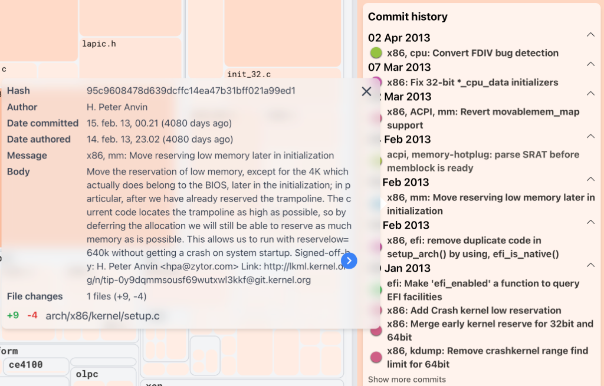
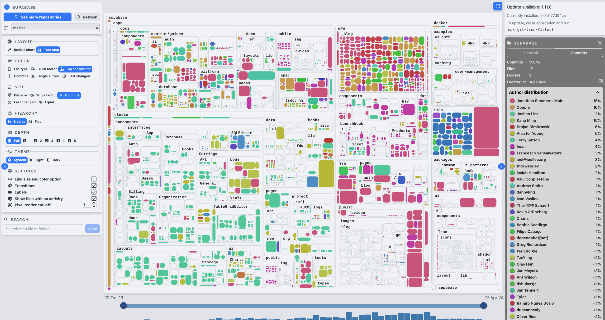
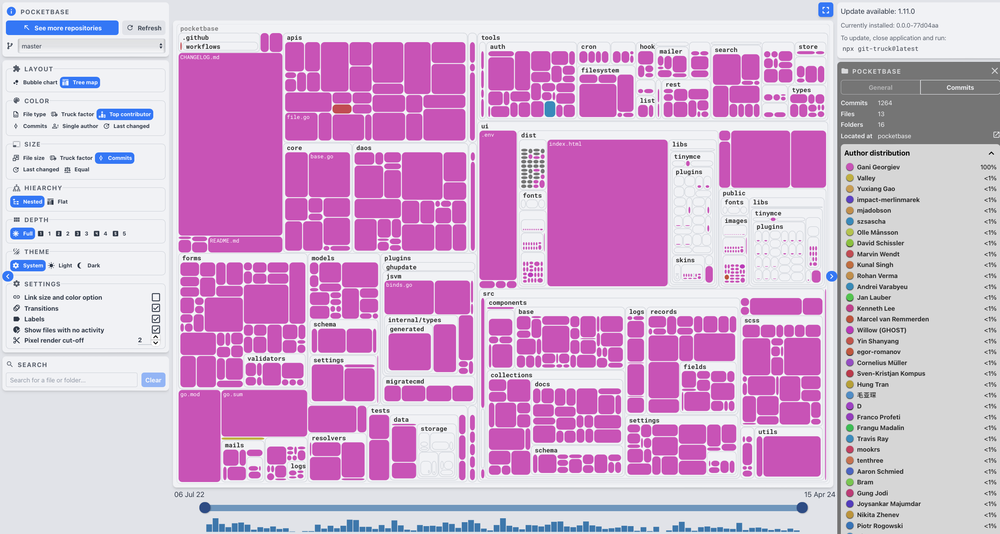

IT University of Copenhagen

#### Software Architecture Reconstruction

# III: Evolutionary Analysis

Mircea Lungu (mlun@itu.dk) 

<a href="https://github.com/mircealungu/reconstruction">github.com/mircealungu/reconstruction</a>


> No man ever steps in the same river twice, for it is not the same river and he is not the same man.

> -- Heraclitus

# Why *Must* Software Systems Evolve? 

> An e-type program that is used in a real-world environment must change, or become progressively less useful in that environment. 
> -- M. Lehman, *The Law of Continuing Change*


In the terminology of Lehman, "e" stands for embedded. 
- an e-type system is *embedded* in the real world
- and since the world changes, so the system must change

There are actually two parts of the "world" where changes can impact a given software system. The real world context and the technical context. 


## The *Real-World Context*

To think about: *Do you have good examples of systems that had to change because the real world changed around them?* 


Some examples: 
- the software that computes taxes in Denmark
- *... ?* 


To think about: 

- *What other kinds of systems are there then? Can you think about another type?* Are there programs that are not impacted by the change in the world around them? 


Examples of such systems are few: a chess engine, an algorithm. It seems that one could even argue that this is the difference between algorithms and software systems: algorithms don't have to change with the world, while systems have to. 


## The Technical-World Context

Think about the `npm` ecosystem. Every day you can execute `npm audit` in your React-based web application to find out that a dozen of the packages you depend on have new versions. Do you upgrade? Do you stay like this for a while? What's the best strategy for managing this portfolio of dependencies?

But this is not only about the `npm` ecosystem. The same situations emerges when a developer builds a system on top of other libraries, and even programming languages change. If one is not keeping up with the evolution of their programming language, their code will sooner or later stop working. How could this be? Some of the libraries their code depends on, might have dropped support for that version of the language. So they either upgrade, or they are left behind. If a developer des not want to be left behind, they have to keep up with all their upstream dependencies. 

Developing software is a little bit like living in Wonderland where the Red Queen is telling Alice: "*In this place you have to run to stay in one place*". 


# Software Evolution

**Software evolution is the continual development of a piece of software after its initial release to address changing stakeholder requirements**.

Observations: 
- It used to be called *software maintenance*
- Nowadays evolution is the preferred term because it highlights the fact that a software system is never *finished*


## Does Architecture Evolve? 

From this POV, the **architecture metaphor might not be the best** - because we normally think about architecture as unchanging. 

This is where Stewart Brand -- one of my favorite non-fiction authors -- comes to help. He wrote a whole book about how buildings evolve over time exactly with the goal of making it clear that architecture is also changing. 


I personally think a ***garden* would have been a better metaphor** for a software system. You must constantly tend to your garden if you want to maintain it. 


# Deriving AR-Relevant Information From VCS 

## Version Repositories Can Help Re-trace Evolution

One of the benefits of the widespread adoption of tools like git is the fact that the meta-data captured in the version control system captures relevant information about the evolution of the system. 


There are **multiple kinds of information that might be relevant for the architecture reconstruction** process that can be recovered from the version control system (VCS). Several are presented in this section. 


## Logical Coupling: the parts of the system that always change together 

When two entities always change together, even if there is no explicit dependency between them, we call that between them there is logical coupling. 

This information can be inferred from the version control. The concept was introduced in 1998 in [a paper](https://plg.uwaterloo.ca/~migod/846/papers/gall-coupling.pdf) by Gall et al. has become quite popular in the meantime. Adam Tornhill has a tool that computes it and wrote a book about many of the concepts discussed in this course. Other tools that compute it exist. 

However, defining the concept is a challenge, because it's after all a matter of selecting thresholds and constants: 
- how many changes should two entities have together before we call them coupled?
- what percentage of changes can be not *together* while still allowing us to consider them coupled?

Pros

- language-independent method 
- can even detect dependencies between parts of the code that are not written in the same language
- can detect dependencies that are indirect 


Cons

- only a small part of the dependencies can be detected this way


## Documentation: fine-grained, based on `git` comments

One of the beautiful insights I recently had is the importance of the git messages associated to commits as documentation. 

Indeed, even if there is no separate documentation, well described commits can serve as an evolving documentation for a software system. Look at the following commit comment, from linux, which documents a (+9, -4) change. How many of us are able to write such detailed changes?



However, the information in the git log could be useful for architecture recovery, only if the developers wrote meaningful messages. 


## Evolutionary Hotspots: the parts of the system have been most changed over time

> *"The value of anything is proportional to time invested in it."* (M. Lungu)


Evolutionary Hotspots -- **an architectural viewpoint that highlights those code entities where most commits are made** 

Notebook: [Computing Evolutionary Hotspots with PyDriller](https://colab.research.google.com/drive/1T4Hj12uD6h5Ody4ietooe5nW-yGFCoX9?usp=sharing)


### Related Concept: Code Churn
 
 = a metric that indicates how often a given piece of code—e.g., a file, a class, a function—gets edited. 
 
 - process metric (*as opposed to? do you remember the alternate concept? *)
 - can be detected with **language independent analysis** (which is good for polyglot systems)

**Why** would places in the system with high-code churn be **relevant**? 
- places in the code with high code churn are likely to be most important parts of the code
- studies observe correlation between [*code churn*](https://linearb.io/blog/what-is-code-churn/) and complexity metrics
- high *code churn* predicts bugs better than size 
- it's likely that they'll require more effort in the future (e.g. yesterday's weather [Girba et al.])

**Challenges** when computing an Evolutionary Hotspots viewpoint: 

- Taking into account developer styles
	- the micro-commits developer vs. the large chunk commiter
- Removing irrelevant files that change frequently (`README.md`, or `LICENSE.md`)
	- Combine with static complexity metrics
	- Manual investigation
- Selecting the appropriate time-interval for the analysis 
	- Weighting towards recency (discarding past changes more)
- Tracking file renames over the course of a system's history
	- Sometimes git loses track of file history: e.g. if you rename and make changes at the same time
- 


# Bonus:  Estimating Code Ownership Based on Git Repositories

This can help find an expert for a given problem and might also provide an estimate of the maintainability related risks of a given project. 

Compare the following two visualizations. Which of the two projects would you consider to be more maintainable, everything else being equal?





The images are generated with [Git-Truck](https://github.com/git-truck/git-truck) -- a git repository visualization tool developed here at ITU. To try it out on your own, use: 

```
git clone git@github.com:zeeguu/api.git
npx -y git-truck-beta@latest
```

Why is the tool defined this way? Because of the **truck factor**: "*the number of people on your team that have to be hit by a truck (or quit) before the project is in serious trouble*". [*A Novel Approach for Estimating Truck Factors*](https://arxiv.org/pdf/1604.06766.pdf), by Avelino et al. discusses some of the challenges of formally defining the concept. 


#### Looking for volunteers: Thomas HK is looking for companies to get feedback on the new time-selection feature in Git-Truck 

To try the feature try: 

```
npx -y git-truck@duck
```


# For Your Projects

Consider enriching your analysis with information about the evolution of the analyzed system.

To think about: what if you could replay the history of a system from the beginning but only showing those files that made it to the end. So project the beginnings through the perspective of the endings. Would that be a useful way of focusing on the most relevant aspects of the system? 

