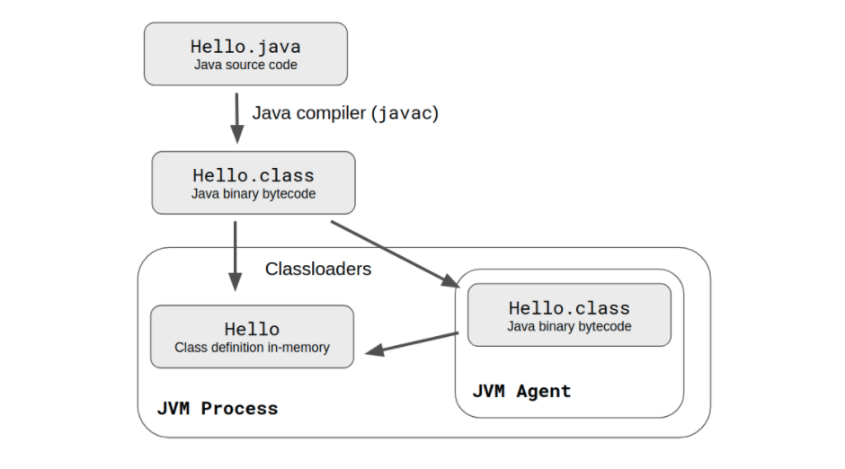

# Reconstruction IV: Dynamic Analysis

In the previous sessions, we have looked at the source code, we have looked at history, and we saw that interesting information is available there. However, we have now to face the elephant in the room: the *running system itself*. We can not *not look* at it in our attempts to understand the system's architecture, even if, this is going to be the most challenging aspect.

There are several ways in which we can do this:
- add ad-hoc logging statements to the system 
- "instrument" the code that is being executed by using reflection
- monitor network traffic for distributed systems 

We will then discuss how can this kind of information be used in architecture recovery. 

## Limitations of Static Analysis

### Case Study: Dead Code Detection

Let us assume that we want to discover whether a given system has code that is not used. This happens quite often actually. 
- How are we going to do it with static analysis? 
- What are the limitations of static analysis in this particular problem? 
	- code might look connected to the rest of the call graph but never be called in practice
	- code might look disconnected but be called using reflectio

### Limitations 

Some of the limitations of static analysis: 

- **Overestimates some relationships** that are only instantiated at runtime
	- runtime polymorphism - from the source code one can not know which of the many alternative implementations is actually used

- **Some information is only really available at runtime**
	- dynamic code evaluation (e.g. `eval`) 
	- code that is dependent on user-driven input
	- usage of reflection

- Can not provide **information about runtime properties** 
	- E.g., memory consumption and timing  might be architecturally relevant

## What Is Dynamic Analysis?

Dynamic analysis is a **technique of program analysis** that consists of **instrumenting** and **observing** the **behavior** of a program while it is executing. 

Dynamic analysis collects **execution traces** = records of the sequence of actions that happened during an execution. 


Think again about the previous *dead code detection* scenario. 

> If we had information from the execution of the system we could exclude some candidates if we see that they are used at runtime.  


## How To Instrument Systems for Analysis?

The key is **instrumenting the system** = modifying the system such that we can extract information from runtime. 

There are multiple such methods. We'll discuss three here: 

### Logging 

Adding log statements in the program can help collect traces of its execution.

The benefits of this approach are: 

- allows surgical precision - adding log statements only where relevant (e.g. if I want to investigate the calls between two particular classes, adding logs only there)

- technology is straightforward to use: `console.log` vs `print`

The limitations of this approach: 

- invasive - implies changing the program

- usually we want to log extensively so there is a lot of manual work needed

#### In distributed systems tracking logs across systems is challenging

The solution is a combination of:

##### Centralized logging
Logging for distributed systems, e.g. services and micro-services, requires the collection all the logs in one place. 

##### Tracking the order of the log messages

A challenge is tracking the order of the logs across systems 
- the simplest way is to **add timestamps in every logging statement**
- the more involved approach is *distributed tracing* - tracking requests as they propagate through multiple microservices by adding a unique *request ID* or *trace ID* to every message


### Dynamic Behavior Modification

What if we could modify every method call to log it's call. Then we could re-create a sequence diagram of the whole execution of a program! 

#### Using Reflection

**Reflection** = the ability of a program to manipulate as data something representing the state of the program during its own execution

In some languages it's easier to do (e.g. Ruby, Python) than in others (Java). 

There are two kinds of reflection:

##### **Introspection** 
= the ability for a program to observe and therefore reason about its own state. 

E.g. listing the methods in a class in Python
- Every class has a `__dict__` that is a dictionary mapping the names of it's attributes to the objects that represent it (e.g. `Exception.__dict__.items()`)
- A method can be detected because it has the `__call__` attribute (e.g. `hasattr(object, '__call__'))

Putting the two together, we can define:
```Python
def methods_in_class(cls):
	return [
		(name, object) 
		for (name, object) 
			in cls.__dict__.items() 
		if hasattr(object, '__call__')]
```


##### **Intercession** 
= is the ability for a program to modify its own execution state or alter its own interpretation or meaning. 

E.g. replacing all the methods in a class with decorators that print call information before executing the original behavior in Python can be done in a few steps:


###### Define a decorator function 

That decorator could simply log the function call before delegating to the function, e.g. 
```Python
def log_decorator( function ):
	def decorated( *args, **kwargs ):
		print (f'I have been called: {function}')
		return function( *args,**kwargs )
	return decorated
```


###### Define a function to decorate all the methods in a class

This can be done by reusing our `methods_in_class` function from above: 
```Python
def decorate_methods( cls, decorator ):
	methods = methods_in_class(cls)
	for name, method in methods:
		setattr( cls, name, decorator ( method ))
```

###### Do the actual decoration

```python
from zeeguu.core.model import User
decorate_methods(User, log_decorator)

u= User.find_by_id(534)
u.bookmark_count()

# to see even further one can instrument also third party libraries!
from sqlalchemy.orm.query import Query
decorate_methods(Query, log_decorator)

```
###### Using introspection to detect the calling site

In the example above we used introspection to figure out the methods in a class. We can also use introspection to query the current state of the Python call stack with the help of the `inspect` package. 

```python
import inspect

def caller(): 
	callee()

def callee():
	print(inspect.stack()[1].function)

caller()
```
**Challenge**: can you plug this solution in the `log_decorator` for a more complete execution trace?

##### Function Wrappers

In the previous section, the `log_decorator` is what is called a **function wrapper** == a pattern inspired from the Decorator design pattern:

- a function *wraps* another function in order to

	- perform some *prologue* and *epilogue* tasks, or to

	- optimize (e.g. cache results )

- while the *wrapper* is *fully* compatible with the wrapped function so it can be used instead

###### Advantages of Wrappers
- make it **easy to automate** (e.g. you could iterate through all the modules and all the classes in Zeeguu using reflection, and deploy a wrapper on every function)

###### Disadvantages of Wrappers
- they introduce an **overhead** (but then, so do all code instrumentation techniques)
- they require to be deployed on **live** objects 
- must be in the same process as the instrumented code

###### Application of Function Wrappers

https://github.com/flask-dashboard/Flask-MonitoringDashboard


#### Runtime Instrumentation

= a technique that modifies the generated code. 

Example: instrumenting Java programs with the Java Agent

- Java programs are compiled into bytecode
- Bytecode is executed on the JVM
- *Instrumenter* provides a Java Agent (via command line argument -javaagent) that modifieds the bytecode before it being executed

  
   

Advantage: 
- JVM bytecode instrumentation works for multiple languages

 
### Network Traffic Analysis

Not considered as part of *traditional dynamic analysis* but becomes more relevant 

- useful for service oriented architectures
- monitors the messages on the wire
- powerful approach for reverse engineering services  

Read: https://danlebrero.com/2017/04/06/documenting-your-architecture-wireshark-plantuml-and-a-repl/

**Note**: An approach like this would be a great starting point for a thesis. 

## How to Run the Instrumented Systems?

### Running the code itself might pose challenges 

- Configuration

- Dependencies

- Unwritten rules

- Some systems don't have a clear entry point (e.g. libraries)

Helpful practices that make running code easier: 

- continuous integration
- containerization
- infrastructure as code

### ## Which Scenarios to Run from the System?

- Run the unit tests if they exist
- Exercise "features"

> A feature is a realized functional requirement of a system. [...] an observable unit of behavior of a system triggered by the user [Eisenbarth et al., 2003].

  
## Limitations of Dynamic Analysis  

- Limited by execution coverage
	> Dynamic analysis is related to testing and shares the same disadvantages. 
	> All the conclusions you draw are valid only with respect to the given input. When it comes to architecture, however, we are generally interested in all possible behavior. (Koshcke, ***What architects should know about reverse engineering and reengineering*** )

- A program does not reach an execution point... => no data (e.g. Word but user never uses the print option)

- Can slow down the application considerably

- Can result in a large amount of of data (a few seconds of execution can result in GB of data for complex systems)


 # Benefits for Architecture Recovery

Dynamic analysis is an essential **complement for static analysis**  for dependency extraction. 

The information extracted from dynamic analysis **can be aggregated** along the same axes as static.

One can do cross-language dependency extraction with the help of dynamic analysis. *Can you think of examples and how would you do this?*


# Challenges for You

Extract dynamic dependencies from your case study system. 

- can you create a wrapper that traces method calls (both the caller and the callee?)

- fully qualified names of the caller method


 

# Bibliography

[1]) [What architects should know about reverse engineering and reengineering](https://citeseerx.ist.psu.edu/document?repid=rep1&type=pdf&doi=05981602215076b7492b87a8a1f7157dcc9c2196) R. Koschke, In 5th Working IEEE/IFIP Conference on Software Architecture (WICSA'05)_(pp. 4-10). IEEE.


# Further Reading

Function Wrappers
- https://wiki.python.org/moin/FunctionWrappers
- Wrappers to the Rescue: http://citeseerx.ist.psu.edu/viewdoc/download?doi=10.1.1.18.6550&rep=rep1&type=pdf

