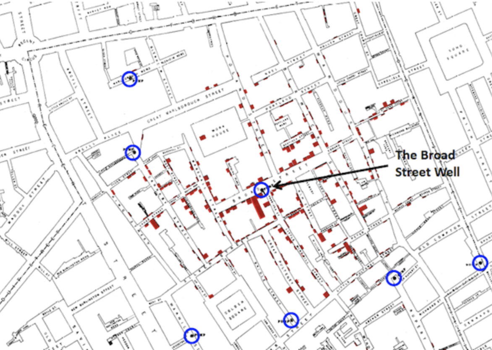
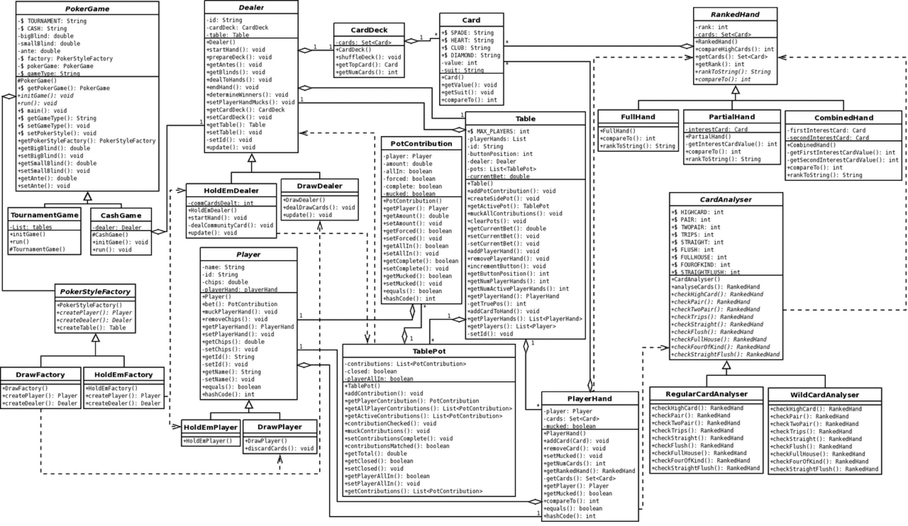
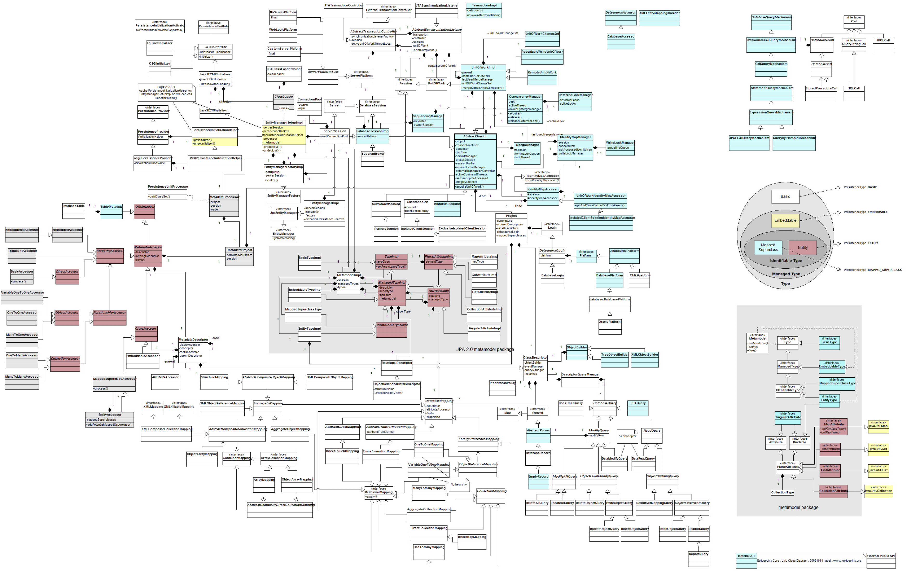
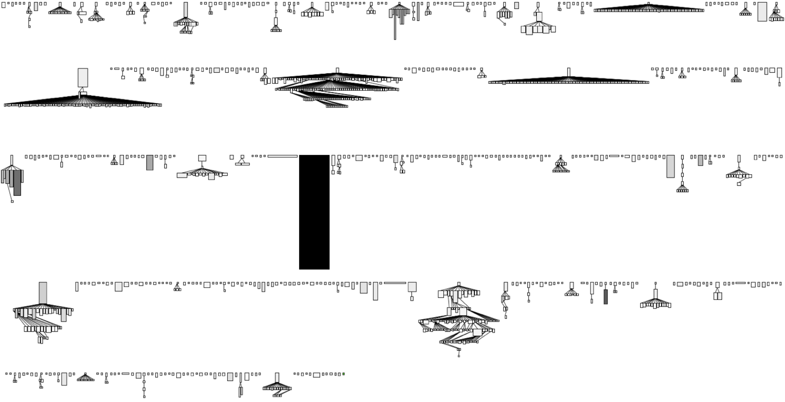
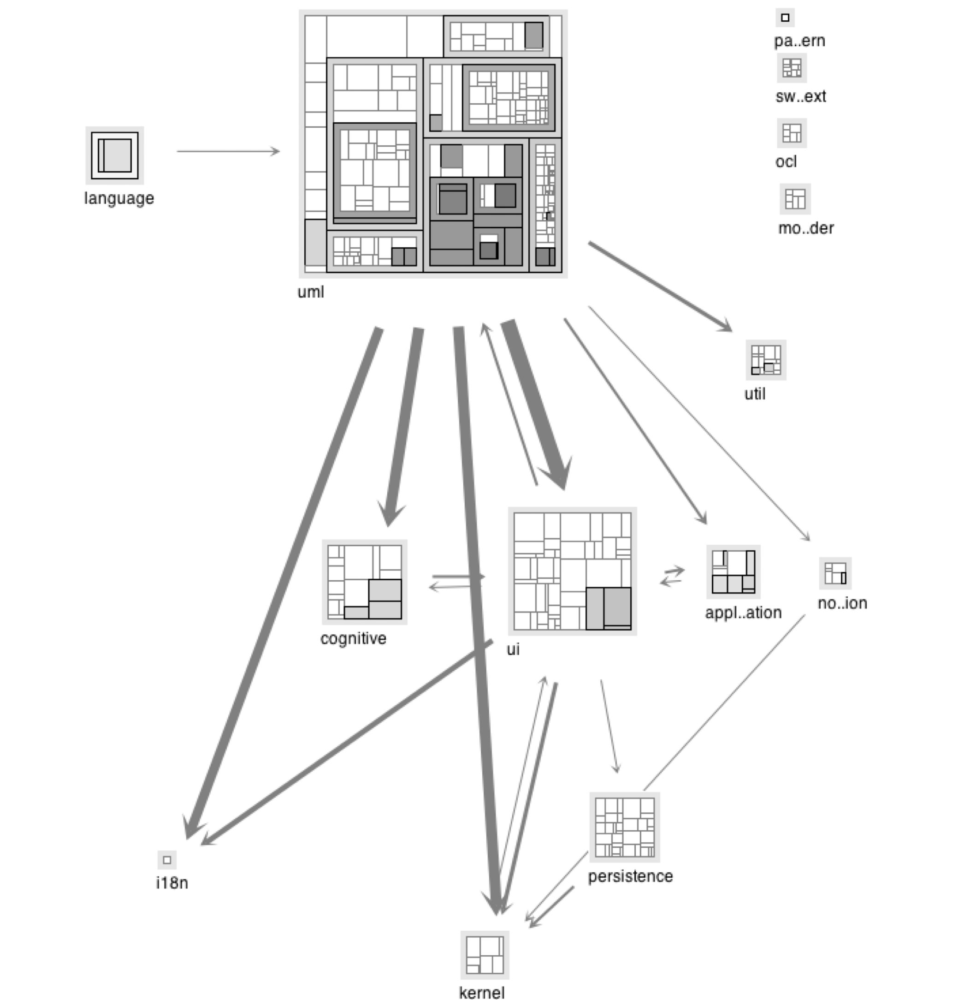

class: center, middle

IT University of Copenhagen

#### Software Architecture

###  Session #11

# Reconstruction (IV): Visualization

Assoc. Prof. Mircea Lungu

mlun@itu.dk

<a href="https://github.com/mircealungu/reconstruction">github.com/mircealungu/reconstruction</a>

---

## Outline 

- The importance of presenting information
- Polymetric Views - Metrics-Enhanced Architectural Views
- Student Submission Examples

---
# The Importance of Presenting Information

Well presented information visualization: 
- Can tell stories
- Can save lives
- Can help understand complexity

---

## Napoleon's Invasion of Russia in One Infographic

???

[**Charles Minard**](http://t.umblr.com/redirect?z=http%3A%2F%2Fwww.edwardtufte.com%2Ftufte%2Fminard-obit&t=OTE3ZmE1M2ZiMTBiYWYwZDgwN2VlN2ZmMzhjYTI3N2JkOWM2MGY2Nyx3YWNGM3RHZQ%3D%3D)’s 1869 graph of Napoleon’s 1812 march on Moscow shows the dwindling size of the army. **Tufte says that it is probably the best statistical graphic ever drawn.**

The broad line on top represents the army’s size on the march from Poland to Moscow. The thin dark line below represents the army’s size on the retreat. The width of the lines represents the army size, which started over 400,000 strong and dwindled to 10,000. The bottom lines are temperature and time scales, and the overall plot shows distance travelled.

A nice modern, [rerendering](https://graphworkflow.com/2019/06/25/minard/) 

---

## Dr. John Snows Cholera Map of London

???

In a now legendary experiment in 1854, Dr. John Snow, a London physician, conducted a simple yet brilliant test that helped to settle the debate about the transmission of cholera. Snow drew a map [see Figure 2 below] of a virulent cholera outbreak in one of the poorest neighborhoods of London – served by central wells and no sewage collection. He plotted the homes and numbers of people affected, and in a flash of insight, mapped the location of the wells that provided water for the hardest hit neighborhoods. The maps he generated and the interviews he conducted with the families of victims convinced him that the source of contamination was the water from the Broad Street well. **He received permission from local authorities to remove the pump, which forced residents to go to other, uncontaminated wells for water. Within days, the outbreak subsided**.”

From: https://www.circleofblue.org/2013/world/peter-gleick-200-years-of-dr-john-snow-a-significant-figure-in-the-world-of-water/

---

## Book Recommendation

Includes the previous examples 

Contains principles for information presentation, e.g. The Five Laws of Data-Ink (T[example](https://www.codeconquest.com/blog/data-ink-ratio-explained-with-example/))
- Above all else, show the data 
- Maximize Data-Ink Ratio
- Erase non-data ink
- Erase redundant data ink
- Revise and edit

Encourages you to think about presenting information 

???

[Maximize Data-Ink ratio at infovis-wiki](https://infovis-wiki.net/wiki/Data-Ink_Ratio) 

---

# Visualizing Software 

- UML
- Polymetric Views

---

## UML As an Information Presentation Mechanism

##### The UML Diagram of a Pocker Game: 25 Classes

---

## A More Realistic UML Diagram

##### Java Link API - A persistence API

---

### Limitations of UML Class Diagrams

- Do not scale well
- Not even ArgoUML has class diagrams about itself

UML
- Designed as a **modeling** language (thus for specification)
- not an information visualization tool

*Solution? Learn from Infovis!*

---

## An Infovis Approach: Polymetric Views

System Complexity of ArgoUML
	- Class Hierarchies
	- Height: LOC
	- Width: NOM
	- Color: number of commits

???

- TODO: add reference to the Polymetric Views paper

---

### Polymetric Views

Infovis approach

Make use of the preattentive processing features
- size
- color
- shape
- position

---

### An Architectural Polymetric View

- Dependency width: number of low-level method calls
- Node size: LOC

