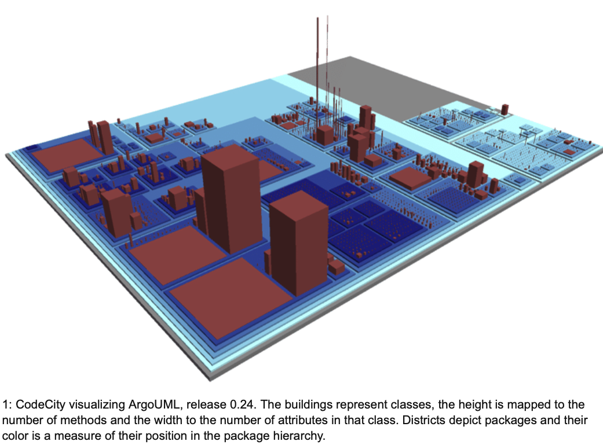
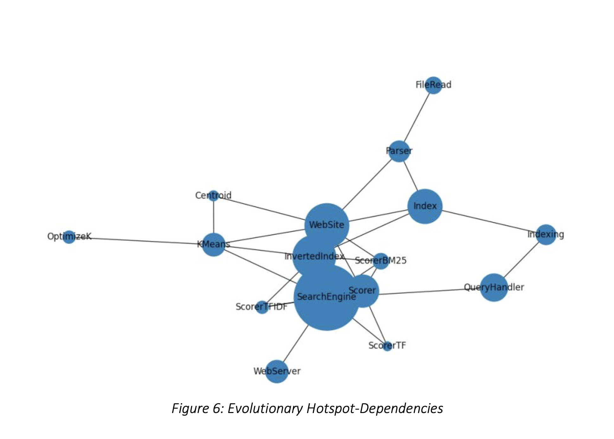
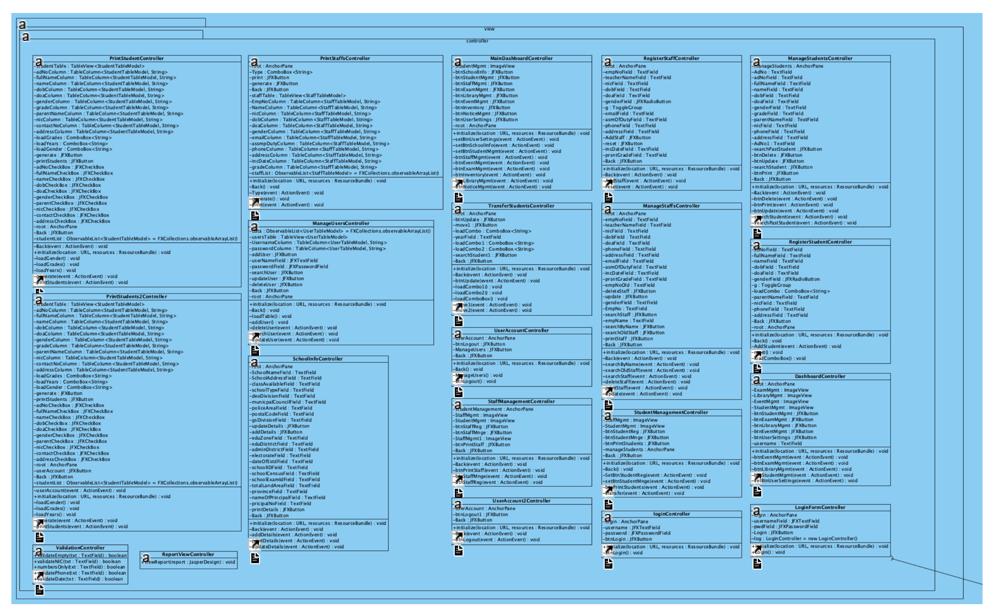
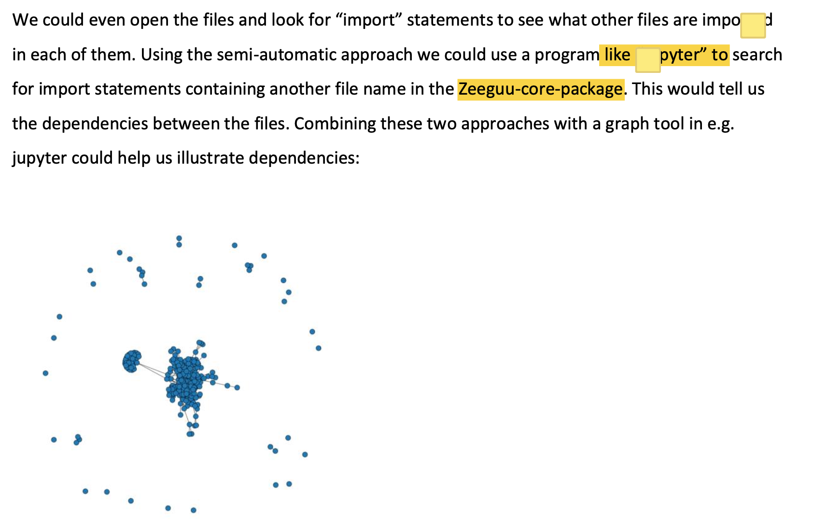
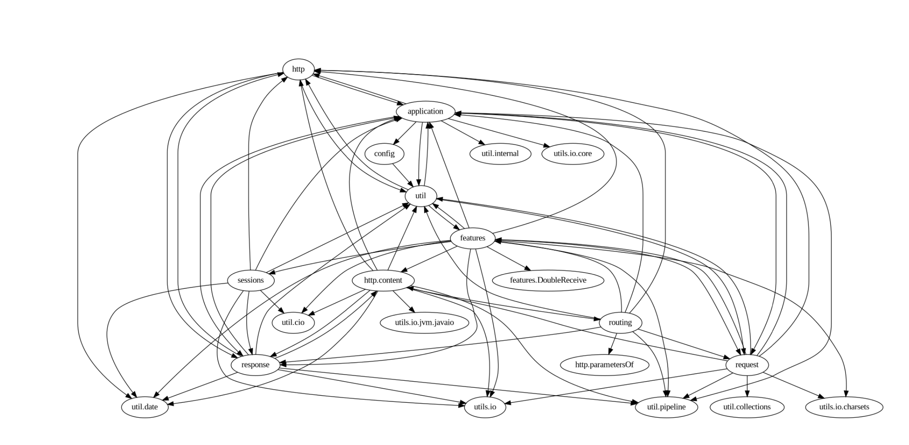
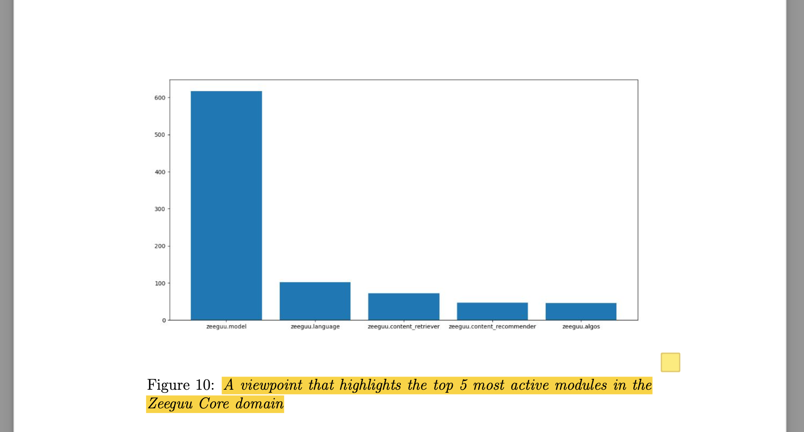
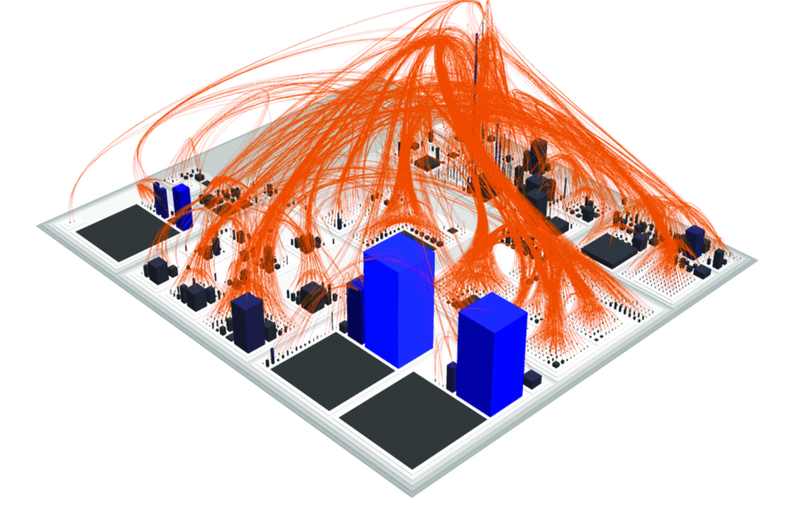
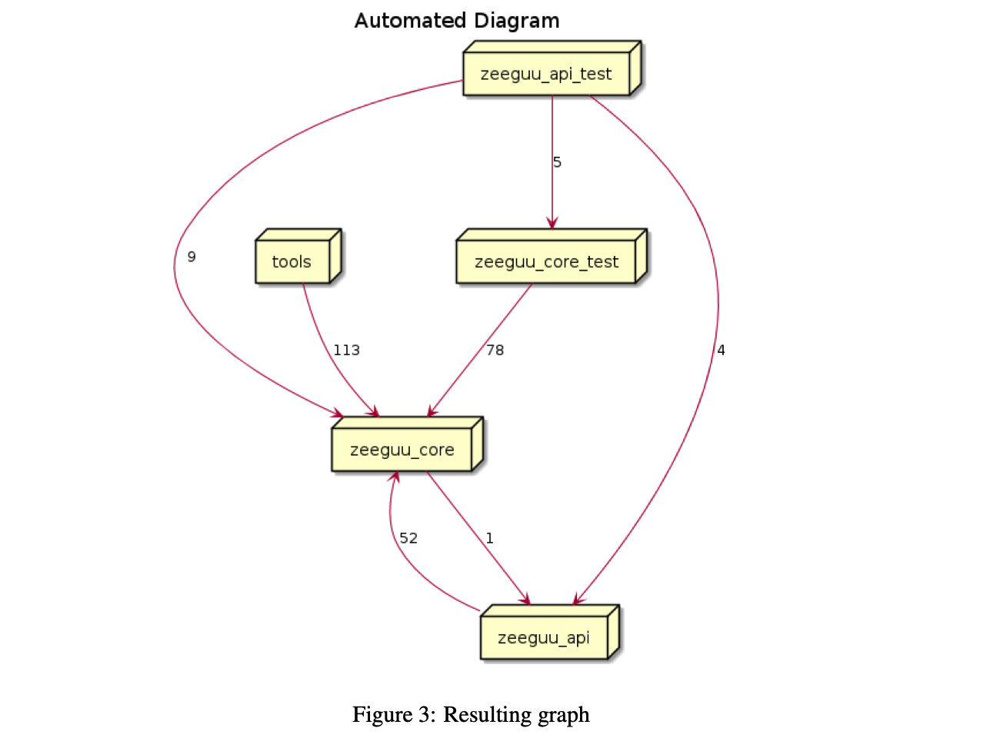

class: center, middle

IT University of Copenhagen

### Software Architecture

#### Architecture Reconstruction

# IV: Visualization

Assoc. Prof. Mircea Lungu

mlun@itu.dk

<a href="https://github.com/mircealungu/reconstruction">github.com/mircealungu/reconstruction</a>

---

## Outline 

- The importance of presenting information
- Polymetric Views - Metrics-Enhanced (Architectural) Views
- Student Submission Examples

---
class: center, middle

# The Importance of Presenting Information

---

## Napoleon's Invasion of Russia in One Infographic

*The Visual Display of Quantitative Information*, E. Tufte

???

[**Charles Minard**](http://t.umblr.com/redirect?z=http%3A%2F%2Fwww.edwardtufte.com%2Ftufte%2Fminard-obit&t=OTE3ZmE1M2ZiMTBiYWYwZDgwN2VlN2ZmMzhjYTI3N2JkOWM2MGY2Nyx3YWNGM3RHZQ%3D%3D)’s 1869 graph of Napoleon’s 1812 march on Moscow shows the dwindling size of the army. **Tufte says that it is probably the best statistical graphic ever drawn.**

The broad line on top represents the army’s size on the march from Poland to Moscow. The thin dark line below represents the army’s size on the retreat. The width of the lines represents the army size, which started over 400,000 strong and dwindled to 10,000. The bottom lines are temperature and time scales, and the overall plot shows distance travelled.

A nice modern, [rerendering](https://graphworkflow.com/2019/06/25/minard/) 

---

## Dr. John Snows Cholera Map of London

*The Visual Display of Quantitative Information*, E. Tufte

???

In a now legendary experiment in 1854, Dr. John Snow, a London physician, conducted a simple yet brilliant test that helped to settle the debate about the transmission of cholera. Snow drew a map [see Figure 2 below] of a virulent cholera outbreak in one of the poorest neighborhoods of London – served by central wells and no sewage collection. He plotted the homes and numbers of people affected, and in a flash of insight, mapped the location of the wells that provided water for the hardest hit neighborhoods. The maps he generated and the interviews he conducted with the families of victims convinced him that the source of contamination was the water from the Broad Street well. **He received permission from local authorities to remove the pump, which forced residents to go to other, uncontaminated wells for water. Within days, the outbreak subsided**.”

From: https://www.circleofblue.org/2013/world/peter-gleick-200-years-of-dr-john-snow-a-significant-figure-in-the-world-of-water/

---

## *The Visual Display of Quantitative Information*, E. Tufte

Introduces: **The Five Laws of Data-Ink ([Example](https://www.codeconquest.com/blog/data-ink-ratio-explained-with-example/))**
1. Above all else, show the data 
2. Maximize Data-Ink Ratio
3. Erase non-data ink
4. Erase redundant data ink
5. Revise and edit

???

[Maximize Data-Ink ratio at infovis-wiki](https://infovis-wiki.net/wiki/Data-Ink_Ratio) 

---
class: center, middle

# Polymetric Views

---

## Software Visualization

"Software visualization techniques represent the intangible structures, interrelations, and interactions of software via visual metaphors in 2D and 3D" (Muller et al.)

Aproaches touched today
- UML
- Polymetric Views (in 2D & 3D)

---

## UML As an Information Presentation Mechanism

##### The UML Diagram of a Pocker Game: 25 Classes

---

## A More Realistic UML Diagram

##### Java Link API - A persistence API: >100 Classes

---

## UML Class Diagrams - Limitations

- Do not scale well
- Designed as a **modeling** language (thus for specification)
- Not used much for documentation(ArgoUML had no class diagrams about itself)

*Alternative? Learn from Infovis!*

---

## System Complexity of ArgoUML > 1000 classes

Entities: Classes: Relationships: inheritance. Height: \# of Attributes; Width: \# of Methods; Color: LOC

---

## Polymetric View

**A view that visualizes multiple metrics together with system structure**

Visual properties on which to map metrics: width, height, color, edges, etc.

[*Polymetric Views – A Lightweight Visual Approach to Reverse Engineering*](https://rmod-files.lille.inria.fr/Team/Texts/Papers/Lanz03d-TSE-PolymetricViews.pdf) , Lanza & Ducasse

---
## A 3D Polymetric View

[*Developer-centric analysis of SVN Ecosystems*](https://www.researchgate.net/publication/265755937_Developer-centric_Analysis_of_SVN_Ecosystems), J. Malnati

---

### Polymetric *Module* Views

**Show dependencies between modules together with multiple metrics.** 

e.g. from Softwarenaut

- Edge width: number of low-level method calls
- Node size: LOC
- Node figure: treemap of contents

---

class: center, middle

# Example Visualisation from Past Student Submissions 

---

## Not bad... but how could we improve? 

--

- Text readability - increase contrast or increase font
- Layout - increase distance between the central nodes
- Add Legend & Scale - otherwise how do I know whether this is 1KLOC or 1MLOC?

---

## Not good... but why?

--
- Too much information; missing the abstraction step
- Unreadable: too low contrast between freground and background

---

## Not good - but why? 

Remember: *The Rational Design Process and Why to Fake it*

--

Intermediate step
- You do not have space for that
- Also... Nobody wants to read that

---

## Not bad - But how to improve? 

--
Filter out ``util``, almost everybody depends on it!

Make view *polymetric*:
- Color intensity on nodes 
- Depedency width 

---

## Not good - why?

--

Do not waste time on showing me screenshots of your system! 
Summarize the system in a paragraph or two at the beginning 

---

## Not very good - why?

--

- Too little information (small data/ink ratio)
- Not very readable (compare font in the image with the font in the caption)

---

## Not very good - why?

--

Lack of abstraction 

---

## Good...but can we improve? 

--

Caption is bad ([explain the figure in a concise manner](https://github.com/mircealungu/student-projects/blob/master/writing_guidelines/Every_Figure_Has_A_Caption.md))

--

More info about the 
- Size of the modules
- Details of most important modules in separate views

---

# Final Words on the Architecture Reconstruction

**Advanced topics** are still left for ASE
1. Dynamic analysis (extract info from the runtime of the system!)
2. Advanced fact extraction (parsing ASTs)
3. Ecosystem dependency analysis 

--

**Thesis Topics** in this area ([github.com/mircealungu/student-projects/](https://github.com/mircealungu/student-projects/labels/software%20architecture))
1. Specifying diagrams in code
2. Integrating diagrams in CI/CD & the IDE
3. Applying ML and NLP techniques
4. Understanding the ecosytem dependencies

---

# Final Words on the Individual Reports

See report [description](https://app.peergrade.io/teacher/courses/f4b1e6e9-2248-4888-957a-4ba4e5db14da/assignments/55e28b2e-e615-4ed0-bbd6-aeb487d4d8d4/settings) 

Remember
- Not more than 1.5K words 
- Quality over quantity
- Do not teach back; assume that the reader knows the course materials
- Consider creating GitHub repo & moving away  from Collab

