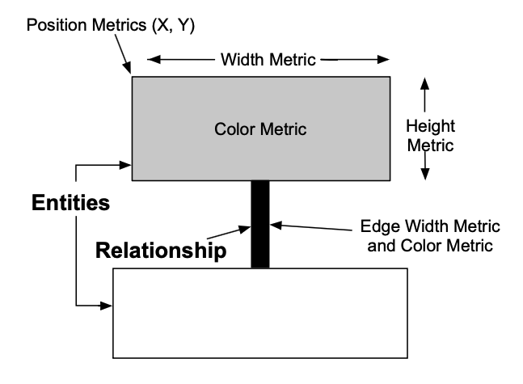

# Visualization

## The Importance of Presenting Information

Visualizing information is a powerful tool. 
### Information Visualization Can Highlight the Essence of Events

[**Charles Minard**](http://t.umblr.com/redirect?z=http%3A%2F%2Fwww.edwardtufte.com%2Ftufte%2Fminard-obit&t=OTE3ZmE1M2ZiMTBiYWYwZDgwN2VlN2ZmMzhjYTI3N2JkOWM2MGY2Nyx3YWNGM3RHZQ%3D%3D)’s 1869 graph of Napoleon’s 1812 march on Moscow shows the dwindling size of the army. **Tufte says that it is probably the best statistical graphic ever drawn.**

The broad line on top represents the army’s size on the march from Poland to Moscow. The thin dark line below represents the army’s size on the retreat. The width of the lines represents the army size, which started over 400,000 strong and dwindled to 10,000. The bottom lines are temperature and time scales, and the overall plot shows distance travelled.

A nice modern, [rerendering](https://graphworkflow.com/2019/06/25/minard/) 

---

### Information Visualization Can Save Lives

In a now legendary experiment in 1854, Dr. John Snow, a London physician, conducted a simple yet brilliant test that helped to settle the debate about the transmission of cholera. Snow drew a map [see Figure 2 below] of a virulent cholera outbreak in one of the poorest neighborhoods of London – served by central wells and no sewage collection. He plotted the homes and numbers of people affected, and in a flash of insight, mapped the location of the wells that provided water for the hardest hit neighborhoods. The maps he generated and the interviews he conducted with the families of victims convinced him that the source of contamination was the water from the Broad Street well. **He received permission from local authorities to remove the pump, which forced residents to go to other, uncontaminated wells for water. Within days, the outbreak subsided**.”

From: https://www.circleofblue.org/2013/world/peter-gleick-200-years-of-dr-john-snow-a-significant-figure-in-the-world-of-water/

Source: *The Visual Display of Quantitative Information*, E. Tufte

---

### Principles of Information Visualization

*The Visual Display of Quantitative Information*, E. Tufte

Introduces: **The Five Laws of Data-Ink ([Example](https://www.codeconquest.com/blog/data-ink-ratio-explained-with-example/))**

1. Above all else, show the data 
2. [Maximize Data-Ink Ratio]([Maximize Data-Ink ratio at infovis-wiki](https://infovis-wiki.net/wiki/Data-Ink_Ratio) )
3. Erase non-data ink
4. Erase redundant data ink
5. Revise and edit

## Software Visualization

"Software visualization techniques represent the intangible structures, interrelations, and interactions of software via visual metaphors in 2D and 3D" (Muller et al.)

Approaches touched today: 
- UML
- Polymetric Views

## UML 

### UML does not scale well not even to 25 classes

Image: Pocker Game
- 25 Classes

### It scales even worse for larger systems

Image: Java Link API
- A persistence API
- Size: > 100 Classes

### UML Class Diagrams - Limitations

- Designed as a **modeling** language (thus for specification)
- Not used much for documentation(ArgoUML had no class diagrams about itself)

## Polymetric Views

### Polymetric View

**A view that visualizes multiple metrics together with system structure**

Visual properties on which to map metrics: width, height, color, edges, etc.

[*Polymetric Views – A Lightweight Visual Approach to Reverse Engineering*](https://rmod-files.lille.inria.fr/Team/Texts/Papers/Lanz03d-TSE-PolymetricViews.pdf) , Lanza & Ducasse

### System Complexity of ArgoUML > 1000 classes

Entities: Classes: Relationships: inheritance. Height: \# of Attributes; Width: \# of Methods; Color: LOC

### Polymetric *Module* Views

**Show dependencies between modules together with multiple metrics.** 
e.g. from Softwarenaut

- Edge width: number of low-level method calls
- Node size: LOC
- Node figure: treemap of contents

## Visualization in your projects

- Compute size metrics, and map them on the nodes in your module view

- Compute dependency metrics and map them on the edges in your graph (e.g. a stronger dependency as a thicker arrow as in the Softwarenaut example)

- Consider 
	- using `pyvis` instead of `networkx` -- it has much nicer visualizations!
	- [exporting the data from networkx](https://networkx.github.io/documentation/stable/reference/drawing.html) into specialized graph visualization tools (e.g. cytoscape, etc.)
