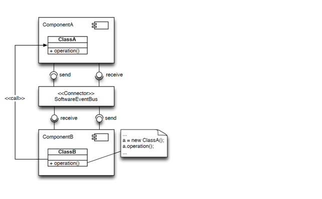

class: center, middle

IT University of Copenhagen

#### Software Architecture 

###  Session #10

# Architecture Reconstruction 

Assoc. Prof. Mircea Lungu

---

# Meta

This and following three lectures
 - Are material that you don't find in the textbook
 - Influenced by past student feedback
 - Have inspired several of your colleagues to choose thesis projects
 
 
Feedback
- [Anonymous feedback form](https://forms.gle/ADWfDZdKfPwdFG1D6)
- Email: mlun@itu.dk
- PR on the GitHub version of the slides if you see bugs

---

# Imagine ... 

- Onboarding on a new system
- Buying a large company
- Risk assessment for security
- Architectural evaluation

What do these have in common?

---

# Even paying 50B for a company does not guarantee architectural diagrams

[link to original tweet](https://twitter.com/elonmusk/status/1593899029531803649)

---
# Discussion

Have you seen architectural documentation for every system?

- No, *Why is it missing?* 
- Yes? 
	- Is it up to date? 
	- *No? Why not?* 
 
---

## Why is Architectural Documentation Obsolete?

discussion...

--

 - it's hard to maintain
 - link (traceability ) between architecture and code is often not obvious
 - no perceived value for the customer
 - because developers 
	 - make changes that are not aligned (**architectural drift**)
	 - make decisions that don't respect earlier decisions (**architectural erosion**)

---

# How to keep Architectural Documentation up to Date?

Enforcing architectural constraints 
- special DSL for architecture constraints definition
- implemented as Unit Tests  

Generating architectural diagrams from code
- as opposed to drawing them in Powerpoint
- we'll see techniques for doing this
- interesting research direction & thesis topic

---

# What Happens When Developers Are Not Aware of Architecture?

e.g. possible scenario of dev not being aware of architecture => architectural anti-pattern.

---

# Architecture Reconstruction (AR)

A reverse engineering approach that aims at reconstructing viable architectural views of
a software application [1]

- an approach = an activity
- reconstructing? why?
- reverse engineering?

a.k.a: *architecture recovery*

 [1] Ducasse & Pollet, [Software Architecture Reconstruction:
a Process-Oriented Taxonomy](https://rmod.inria.fr/archives/papers/Duca09c-TSE-SOAArchitectureExtraction.pdf)

---

# Reverse Engineering

“**Reverse Engineering** is the process of analyzing a subject system to identify the system’s components and their interrela- tionships and create representations of the system in another form or at a higher level of abstraction.” (Demeyer et al., [Object Oriented Reengineering Patterns](http://scg.unibe.ch/download/oorp/OORP.pdf), Chapter 1.2)

Key takeaways: 
- identify components & relationships
- higher level of abstraction

Relation with architecture recovery:
- similar activities

---

# Reengineering

“ ... is the **examination and alteration** of a subject system to reconstitute it in a new form” (Demeyer et al., [Object Oriented Reengineering Patterns](http://scg.unibe.ch/download/oorp/OORP.pdf), Chapter 1.2)

Relation with AR:
- AR could be a possible first step in reengineering

---

# A Process for Reconstruction: Symphony

Paper: Van Deursen et al., [Symphony: View-Driven Software Architecture Reconstruction](https://ipa.win.tue.nl/archive/springdays2005/Deursen1.pdf)

- Recovers views and viewpoints as in IEE 1471 / 3+1
- Distinguishes between three kinds of views:
    1. Source 
     - view extracted from artifacts of a sytem
     - not necessarily architectural (e.g. AST)
    1. Target  
     - describes architecture-as-implemented
     - any of the 3+1 views
    1. Hypothetical 
     - architecture-as-designed
     - existing documentation
     - presentations

---

## Symphony Stages: Design (blue) & Execution (yellow)

---

## Symphony: Design

Problem elicitation
- “Business case” for reconstruction
- What is the problem? 

Concept determination
- What architectural information is needed to solve the problem?
- Which viewpoints are relevant?

---

## Symphony: Execution

Data gathering
 - collecting and extracting low-level source views
 - can involve a multitude of sources
 
 
Knowledge inference
 - going from source to target views
 - abstracting low-level information
 
 
Information interpretation 
 - analysis, creating new documentation

---
class: center, middle

# Data Gathering

Example: [Google Collab with Basic Data Gathering](https://colab.research.google.com/drive/1oe_TV7936Zmmzbbgq8rzqFpxYPX7SQHP#scrollTo=0ruTtX88Tb-w)

---
# Individual Assignment

### Goal is to
- recover the architecture of an existing system

- document the outcome in an **individual report**
	- brief (not more than 3 -- 5 pages)
	- do not explain to us what Symphony does in the report
	- focus on your results

---

# Individual Assignment (contd.)

### Case-Study Systems

1. The Zeeguu Project - **default**
	- [Online Deployment](https://zeeguu.com) (invite code: zeeguu-beta)
	- Code:
		- Python Backend: [Zeeguu-API](https://github.com/zeeguu/API)
		- React Frontend: [Zeeguu-Web](https://github.com/zeeguu/web) 
	- A [paper](https://github.com/zeeguu-ecosystem/CHI18-Paper/blob/master/!AsWeMayStudy--Preprint.pdf) about the system

2. Another system that you know
	- if it has comparable complexity (>200 files)
	- you confirm with me about the appropriateness of the system

---
# Individual Assignment (contd.)

### Viewpoints to Recover

1. Module Viewpoint
	- we will write example code snippets in collab to support this
	- makes the most sense for the Zeeguu system

1. Other Viewpoints
	- some of your colleagues looked at the docker-compose.yml to figure out deployment
	- might make more sense for another system - the Zeeguu one is too simple (could be done together with the module)

---

# Individual Assignment (contd.)

### Tools 
- are important for recovery

- **if you can program**, then this is your chance to be coding **analysis tools** over the upcoming lectures
  - you can still code as a team! (you only have to write the analysis on your own)

- **if you can't program**, then you'll have to find third party tools (the time the programming ones spend on programming, you'll be spending on finding third party tools) 

---

# For Next Week

  
### Reading
- [Symphony: View-Driven Software Architecture Reconstruction](https://ipa.win.tue.nl/archive/springdays2005/Deursen1.pdf)

- [Demeyer et al., Object Oriented Reengineering Patterns](http://scg.unibe.ch/download/oorp/OORP.pdf)
	- Chapter 1.2 - Reengineering and Reverse Engineering
	
  
### Practice
- [Basic Data Gathering](https://colab.research.google.com/drive/1oe_TV7936Zmmzbbgq8rzqFpxYPX7SQHP#scrollTo=0ruTtX88Tb-w)
	- Can you think about techniques for "abstracting" this information? 
	- Think about: are there any dependencies that we're not extracting?

