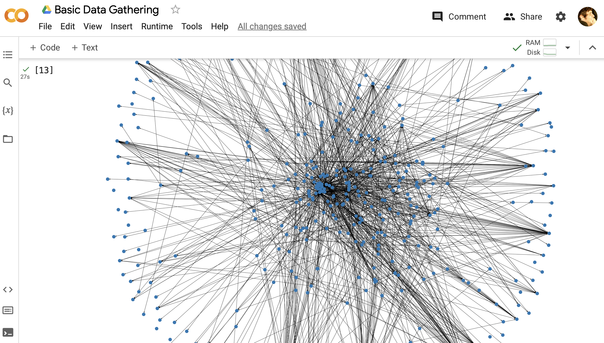

## Lecture #11

# Architecture Reconstruction (II)

M. Lungu 

mlun@itu.dk

---

### In the Previous Episode...

---

Approaches
- Extract - abstract - view
- Symphony 

Case Study: Zeeguu-Core
  - **Source View**: Modules & Dependencies
  - **Entities**: .py files in the project
  - **Relationships**: import statements between .py files

Today: 
- [Basic Abstraction / Knowledge Inference](Basic_Abstraction.ipynb)
- [Advanced Extraction: Parsing and ASTs](Advanced_Dependency_Extraction.ipynb)
- [Individual Project Description](https://docs.google.com/document/d/10bTyUS4ZocReS3j2AxHak_-rBh_Yv_0NM6XDQrt0YkY/edit#)
- Sneak peek at snippets from last year's reports

For Next Time
- Choose a system for yor case study
  - start familiarizing yourself with the system
    - [read all the code in one hour](https://eng.libretexts.org/Bookshelves/Computer_Science/Book%3A_Object-Oriented_Reengineering_Patterns_(Demeyer_Ducasse_and_Nierstrasz)/03%3A_First_Contact/3.03%3A_Read_all_the_Code_in_One_Hour)
    - download the code; can you make it run locally?
  - you should at least know what the system does before trying to recover it's architecture
  

- If your system is a Python system start applying the scripts of today on it
  - Consider applying them on [Zeeguu-API](https://github.com/zeeguu-ecosystem/Zeeguu-API) 
    - you'll have to make a few changes to the code though
    - Should be doable even if you don't have much programming skills (or?)
    - Submit [anonymous questions](https://docs.google.com/forms/d/e/1FAIpQLSeAyKO1WUYn9W9-ZN3UrPU2ScEkI0a6fKZsNMHmtuLUb6RHAg/viewform) or post on Teams if you encounter any problems 

- If you're a programmer: try implementing some of the programming challenges [for abstraction](Basic_Abstraction.ipynb#Programming-Challenges) and [extraction](Advanced_Dependency_Extraction.ipynb#Programming-Challenge)
- If you're not a programmer: start looking for tools that you'd like to use and start evaluating them

