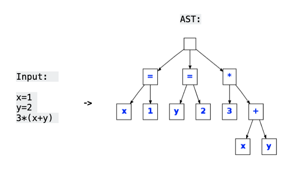

## Lecture #11

# Architecture Reconstruction (II) !!!

Abstracting Low Level

M. Lungu 

mlun@itu.dk

---

### The *source view* obtained last time

- **System**: Zeeguu-API
- **Source View**: Modules & Dependencies
- **Entities**: .py files in the project
- **Relationships**: import statements between .py files

---
## Making sense of the graph

- Adding labels; What do we realize?
--
we're showing also modules that are external! 
if our goal is understanding *this system* we should focus.

#TODO: 5 min programming task: filter out the non-system dependencies, given that the system ones are all in the "zeeguu." package

--

- finding a better layout: 
	- hint: kamada kawai
	- by inspecting the view again we see that "tests" are also added there... they introduce a lot of noise
	- filtering out tests? 2min

--

- abstracting into a separate function the `interesting_module`
- what strategies can we have here? 

--

*still too much detail: how can we simplify further?*

---
# Knowledge Inference / Abstraction

>  The reconstructor creates the target view by **condensing the low-level details of the source view** and **abstracting them into architectural information**. 
>
> The mapping rules and domain knowledge are used to **define a map between the source and target view**. 
> 
> -- Symphony Paper, Section 6.2

---
## Approach 1: Manual Mapping of Files to Folder

- Developers group entities meaningfully in the folder tree; why not use that? 
- Works for most languages

Coding Example: 
- [Notebook in Google Collab](https://colab.research.google.com/drive/1IPPZytBD8ralYyTfofX_46DelXg2YF38#scrollTo=iQwzASq7XKEi)

---

## Approach 2: Automatic Aggregation + Top-Down Exploration

- What if we automatically aggregated dependencies along the module dependency tree?
- We could get something like... [Softwarenaut](https://vimeo.com/62767181)

  - automatically aggregate to the highest level
  - then interactively explore 
  - this is what's called a ** semi-automatic ** approach
  
  ---

## Approach 3: Mapping Using Naming Conventions 

> For example, **if the mapping contains a rule about using naming conventions to combine classes into modules**, the resulting map lists each class and the module to which it belongs. 
>
> This activity may require either interviewing the system experts in order to formal- ize architecturally-relevant aspects not available in the im- plementation or to iteratively augment the source view by adding new concepts to the source viewpoint
>
> -- Symphony, 6.2

- Mini Topic: [Reflexion Models](Reflexion_Models.ipynb)

---

## Approach 4: Network Analysis

- PageRank [2]

- Automatic Clustering
     - has been tried with 
       - coupling cohesion
       - natural language analysis
     - even in the case of clustering we still need human intervention

[2] [Ranking software artifacts (pdf)](http://scg.unibe.ch/archive/papers/Peri10bRankingSoftware.pdf). F Perin, L Renggli, and J Ressia

---

## Software Metrics

Popular approach to abstracting code

Several well-known structural metrics
- LOC - lines of code 
- NOM - number of methods

- CYCLO (Cyclomatic/McCabe Complexity) [3]
    - number of linearly independent code paths through source code (functions of the number of branches)
    - often used in quality: too much complexity is a bad thing
    - hidden partially by polymorphism
    
[3] Cyclomatic Complexity: https://en.wikipedia.org/wiki/Cyclomatic_complexity

---

## Computing Properties of Modules

Remember the Definition of Architecture "modules, **their properties**, and the relationships between them"

Possible relevant properties: 
  - size
  - complexity

Coding Example: 
- [Notebook in Collab](https://colab.research.google.com/drive/1IPPZytBD8ralYyTfofX_46DelXg2YF38#scrollTo=h6smbfIlcggm)

---

## Importance of Dependencies

To tell a story we need subjects and actions

To tell the story of a module view we need also subjects and actions
  - subjects are the nodes in the view
  - the actions are the meanings of the dependencies

In your project aim to describe also the reason for the dependencies (at least the most essential ones)

---

## Discussion & Lessons Learned (1)

- External dependencies (3rd party modules) can be filtered to remove noise
- Module views allow the detection of misdirected dependencies
- Mapping metrics on visualizations helps make sense of the data

---

## Discussion & Lessons Learned (2)

- Semi-automatic solutions are always required in AR

- The difference between the views recovered today and a hand-drawn UML diagram? 
  - what we created today is always telling the truth
  - but, **maybe not all the truth?**

---

## Programming Challenges

  - Can you visualize how "strong" a dependency is? 
  - Can you create a more general file-to-module-mapping function?
  - Consider using `pyvis` instead of `networkx` -- it has much nicer visualizations!
  - Consider running [networkx.pagerank](https://networkx.org/documentation/stable/reference/algorithms/generated/networkx.algorithms.link_analysis.pagerank_alg.pagerank.html) on the graph from your case study
  - Consider [exporting the data from networkx](https://networkx.github.io/documentation/stable/reference/drawing.html) into specialized graph visualization tools 

---

## What are the limitations of our relationship extraction?

--

- Missing Details
- Imprecisely Extracted

*Why?* 

---

### Missing Details

Other relationships that are more precise exist between the elements of the system
- Inheritance between classes
- Implementation of interfaces
- Method call
- The *cardinality of the relationship is not clear*
	- one import might be used 100 times in the file
	- another one might not be used at all

---

### Imprecisely Extracted
- Even imports are too imprecisely extracted
- What if an import is in a comment
- What if it is inside of a method
- What if it is inside of a commented out method?

*Why?*  

Because of the limitations of regular expressions.

*Solution?*

Parsing. 

---

## Parsing Source Code

  
- basic component in compiler technology: a.k.a. semantic analysis
- a precise way of **extracting** information from source code (vs. RE)

Approaches
- manual: e.g. PEGs (Parsing Expression Grammars)
- parser generators (Bison, Antlr, etc.)
  

In general, a complicated business 
- See: A Few Billion LOC Later
- use a language specific parsing library (e.g. `ast` package in Python)

---

## Parse Tree

- Full representation of the structure of a program
- Includes whitespace (e.g., EOL): empty boxes in  the figure
  

---

## AST = Abstract Syntax Tree

- Minimal representation of the meaning of the program
- Nodes correspond to constructs in the language
- Enables: inspection, modification and program transformation

  

---

## In Python: the `ast` package

- `ast` package ([docs](https://docs.python.org/3/library/ast.html)) is part of the standard language distribution
- similar packages in other languages
- tree of nodes representing syntactic constructs
- nodes are instances of ast.AST
 

---

### AST nodes

Have two types of attributes:

- attributes (properties)

- lineno, col_offset

- fields (subnodes)

- One of 5 types: identifier, int, string, object, bool

---

### Visiting an AST

  

The Visitor design pattern strikes back :)

- Your class should subclass `ast.NodeVisitor`

- `NodeVisitor` subclasses traverse an AST

- Traversal is depth-first, preorder

- i.e. first node, then children

- You become involved by defining visit_<nodetype> methods

	- Visit your chidren, or define `generic_visit`
	
	- generic_visit calls visit() on all children of the node.

- Note: child nodes of nodes that have a custom visitor method won’t be visited unless the visitor calls generic_visit() or visits them itself.

  
- visit lets you *skip* subtrees
	- if you don't call generic_visit the visitor will not recurse in the current node
	- can be convenient for expediency

---

# Backmatter

Today: 
- [Basic Abstraction / Knowledge Inference](Basic_Abstraction.ipynb)
- [Advanced Extraction: Parsing and ASTs](Advanced_Dependency_Extraction.ipynb)
- [Individual Project Description](https://docs.google.com/document/d/10bTyUS4ZocReS3j2AxHak_-rBh_Yv_0NM6XDQrt0YkY/edit#)
- Sneak peek at snippets from last year's reports

For Next Time
- Choose a system for yor case study
  - start familiarizing yourself with the system
    - [read all the code in one hour](https://eng.libretexts.org/Bookshelves/Computer_Science/Book%3A_Object-Oriented_Reengineering_Patterns_(Demeyer_Ducasse_and_Nierstrasz)/03%3A_First_Contact/3.03%3A_Read_all_the_Code_in_One_Hour)
    - download the code; can you make it run locally?
  - you should at least know what the system does before trying to recover it's architecture
  

- If your system is a Python system start applying the scripts of today on it
  - Consider applying them on [Zeeguu-API](https://github.com/zeeguu-ecosystem/Zeeguu-API) 
    - you'll have to make a few changes to the code though
    - Should be doable even if you don't have much programming skills (or?)
    - Submit [anonymous questions](https://docs.google.com/forms/d/e/1FAIpQLSeAyKO1WUYn9W9-ZN3UrPU2ScEkI0a6fKZsNMHmtuLUb6RHAg/viewform) or post on Teams if you encounter any problems 

- If you're a programmer: try implementing some of the programming challenges [for abstraction](Basic_Abstraction.ipynb#Programming-Challenges) and [extraction](Advanced_Dependency_Extraction.ipynb#Programming-Challenge)
- If you're not a programmer: start looking for tools that you'd like to use and start evaluating them

