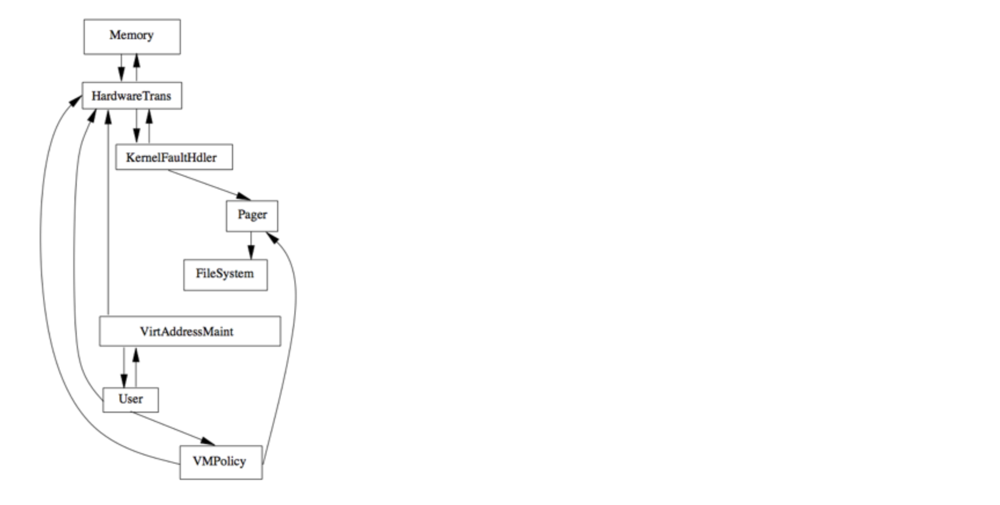

# Reflexion Models

A reflexion model indicates **where the source model and high-level model differ**

1. Convergences
1. Divergences
1. Absences

Can be considered as a *type of architectural viewpoint*

## Case Study

The VMS of Linux

### 1. Modules and dependencies as drawn by the maintainers

### 2. Mapping the modules (by the maintainers)

### 3. Comparing the As-Is vs. As-Envisioned Views

## Source Model Computation

Calculated with lightweight lexical approach to source
code extraction

- Flexible: few constraints on source
- Tolerant: source code can be incomplete, not compilable, ...

## Iterative Process

 
    Repeat
    * Define/Update high-level model of interest
    * Extract a source model
    * Define/Update declarative mapping between high- level model and source model
    * Reflexion model computed by system
    * Interpret the software reflexion model.
    Until “happy”

## Semi-automatic

- Requires developer input, at least assumptions about the system
- Has to be interpreted by developer 

### References

Software Reflexion Models: Bridging the Gap between Design and Implementation. Gail C. Murphy, David Notkin, and Kevin J. Sullivan. In IEEE Trans. Softw. Eng. 27(4) p. 364—380, April 2001
